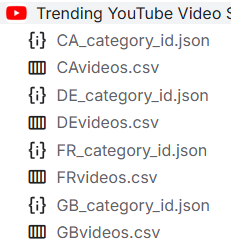

#
<h1 align="center">Youtube Data Analysis<br></h1>  
<h3 align="center">Build ETL Pipelines for Youtube sample Data using terraform<br><h3>

 [](https://github.com/LogicAL007/youtube_data_analaysis_with_aws)
[](https://github.com/LogicAL007/youtube_data_analaysis_with_aws)

## Table Of Contents
📌 [Poject Description](#udapeople)
\
📌 [Prerequisites](#prerequisites)
\
📌 [Architecture](#Architecture)
\
📌 [Tools](#tools)
\
📌 [Files](#files)
\
📌 [Project_Review](#project_review)
\
📌 [License](#license)


<h2 align="center">Project Description</h3>   
<p align="center">
 This project builds a comprehensive ETL (Extract, Transform, Load) pipeline for analyzing YouTube data using AWS services. The pipeline processes raw data stored in S3, performs cleansing and enrichment using AWS Glue, and prepares the data for analytical queries and reporting. The entire infrastructure is managed and deployed using <i>Terraform</i>.
</p>

## Prerequisites

Before you begin, ensure you have the following:

🪡[**AWS account:**](https://aws.amazon.com/)  An active AWS account with the necessary permissions.

🪡[**Terraform:**](https://developer.hashicorp.com/terraform/install) Installed and configured on your local machine click on the link to install terraform.

🪡[**AWS CLI:**](https://aws.amazon.com/cli/) Configured with the necessary permissions to interact with AWS services.[](https://aws.amazon.com/cli/)

## Architecture

The architecture for this project is as follows:


## Problem Statement

The YouTube data collected from various sources is in raw, unclean formats, consisting of both CSV and JSON files. The CSV files contain video metadata across different regions, while the JSON files store category mappings and other hierarchical information. However, these datasets are fragmented and inconsistent, making it difficult to perform meaningful analysis.

Key challenges include:
1. **JSON Normalization:** The JSON data contains nested structures that need to be flattened, with specific fields extracted and joined with the CSV data.
2. **Data Cleansing:** The raw CSV data contains inconsistencies, duplicates, and missing values, which need to be cleaned before any further processing.
3. **Data Integration:** The CSV and JSON files must be joined into a single unified table to create a comprehensive dataset for analysis.
4. **performance optimization**: The joined data needs to be stored in a format that is optimized fo better performance
## Solution
In the ETL (Extract, Transform, Load) pipeline for YouTube data analysis, each stage of the process has a specific role and purpose. Here's a detailed breakdown of what happens in each stage:

### 1. **Data Ingestion (Extract)**
   - **Objective:** To gather raw data from YouTube and load it into a staging area within the data lake for further processing.
   - **Process:**
     - **Source Systems:** Data from YouTube, such as video statistics, metadata, and user interactions, is collected.
     - **S3 API Upload:** This data is uploaded to an Amazon S3 bucket using the AWS S3 API or other data transfer methods, in this case we are uploading from our local machine.
     - **Landing Area:** The uploaded data is stored in a specific folder structure in S3 (Landing Area) that organizes it by date, region, or other relevant dimensions.
     - **Lambda Trigger:** An AWS Lambda function may be triggered by the arrival of new data in the S3 bucket. This function initiates the data processing stage by passing the event to directly to AWS data catalog as a parquet file after normalization.

### 2. **Data Processing (Transform)**
   - **Objective:** To clean, enrich, and transform the raw data into a more structured format suitable for analysis.
   - **Process:**
     - **AWS Glue Crawlers:** These crawlers automatically scan the landing area in S3 to detect new data. The crawlers identify the schema and catalog the data in the AWS Glue Data Catalog.
     - **AWS Glue Jobs:** Several Glue jobs are set up to process the data:
       - **Cleansing:** The data is cleaned by removing duplicates, correcting errors, and filling in missing values.
       - **Enrichment:** Additional information might be added, such as mapping YouTube category IDs to more descriptive labels.
       - **Transformation:** The raw data is transformed into a more suitable format (e.g., converting CSV to Parquet for efficient querying) and organized into partitions for performance optimization.
       - **Example:** In the provided `glue_job_with_pushdown.py`, the job could be handling the transformation and filtering of specific datasets based on parameters passed in (e.g., region or date).

### 3. **Data Storage (Load)**
   - **Objective:** To store the processed data in a structured manner that supports efficient querying and analysis.
   - **Process:**
     - **Cleansed/Enriched Data:** The transformed data is stored in a different S3 bucket or folder within the data lake, often organized by partitions (e.g., by region or date).
     - **Analytics/Reporting Data:** A final transformation may take place to prepare the data for specific reporting or analysis needs. This data is stored in another S3 bucket, optimized for querying.
     - **AWS Glue Data Catalog:** All processed data is cataloged, making it easily discoverable for tools like AWS Athena. The catalog includes metadata about the data's schema, partitions, and locations.

## Tools Used

- **AWS S3:** For data storage.
- **AWS Glue:** For ETL processing and data cataloging.
- **AWS Lambda:** For event-driven processing(in this case, S3 triggers).
- **AWS Athena:** For querying data stored in S3.
- **AWS CloudWatch:** For monitoring and alerts.
- **Terraform:** For infrastructure as code.

## Data source

This dataset used is a daily record of the top trending YouTube videos.This dataset includes several months (and counting) of data on daily trending YouTube videos. Data is included for the US, GB, DE, CA, and FR regions (USA, Great Britain, Germany, Canada, and France, respectively), with up to 200 listed trending videos per day you can download the data from [here](https://www.kaggle.com/code/arslanali4343/trending-video-analysis/input) and it looks like this :


## Steps in setting up the Project
To help you run the project, here is a step-by-step guide that will walk you through setting up the infrastructure, deploying the ETL pipeline, and running the data analysis:
### Step 1: Clone the Repository
First, clone the repository containing the Terraform files and related scripts to your local machine.

```bash
git clone https://github.com/LogicAL007/youtube_data_analysis_with_aws.git
cd youtube_data_analysis_with_aws
```

### Step 2: Install Prerequisites
Ensure you have the following tools installed and configured:

- **Terraform**: [Install Terraform](https://learn.hashicorp.com/tutorials/terraform/install-cli)
- **AWS CLI**: [Install AWS CLI](https://docs.aws.amazon.com/cli/latest/userguide/install-cliv2.html)
  
Configure AWS CLI with the necessary credentials:

```bash
aws configure
```

### Step 3: Modify `variables.tf` and zip the lambda code
Before deploying the infrastructure, update the `variables.tf` file with your specific configurations, such as S3 bucket names, IAM role names, and any other variables that need to be customized for your environment. change director to the lamdba folder and run the bash command to zip the lambda code
```bash
cd lamda
bash lambda.sh
```

### Step 4: Initialize Terraform
Navigate to the directory containing your Terraform files and initialize Terraform to download the required providers and set up your environment.

```bash
terraform init
```

### Step 5: Review and Apply Terraform Plan
Review the Terraform plan to ensure it meets your expectations.

```bash
terraform plan
```

If everything looks good, apply the Terraform plan to deploy the infrastructure.

```bash
terraform apply
```

### Step 6: Upload Data to S3 Buckets
Once the infrastructure is up, use the provided `s3commands.sh` script to upload the necessary data files to the S3 buckets.

```bash
bash s3commands.sh
```

This script will copy raw data files to the appropriate S3 paths following the Hive-style patterns.

### Step 7: Trigger the ETL Pipeline
The ETL pipeline is configured to trigger on demand, you may need to trigger the initial data processing step manually.

### Step 8: Monitor the Pipeline
Monitor the progress of the ETL pipeline using AWS CloudWatch. You can check the logs for Glue jobs, Lambda functions, and other components to ensure everything is running smoothly.

### Step 9: Review Analytics and Reports
If you have set up analytics tools like QuickSight, Power BI, or Qlik, you can now create reports and dashboards based on the processed data, here is an example of a dashboard after an EDA.

### Step 10: Tear Down the Infrastructure (Optional)
If you no longer need the infrastructure, you can destroy it using Terraform to avoid unnecessary costs.

```bash
terraform destroy
```

## Summary
Each stage of the ETL pipeline serves a distinct purpose, from extracting raw data to transforming it into a usable format, and finally loading it into a structured environment for analysis. This process ensures that large volumes of YouTube data can be managed effectively, providing timely and actionable insights to support business goals.
